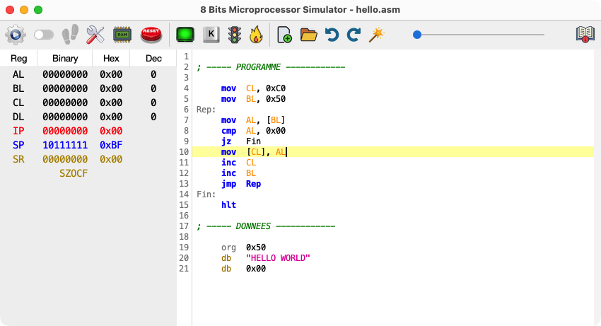
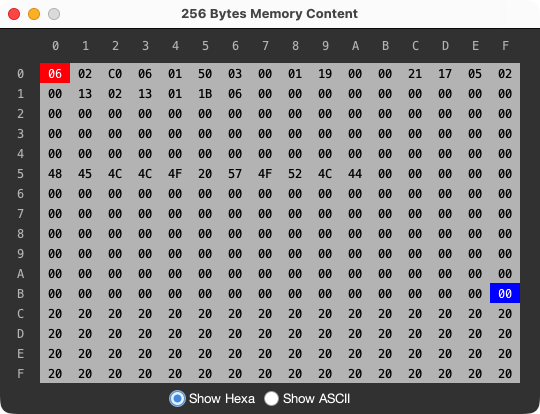
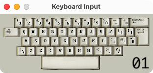
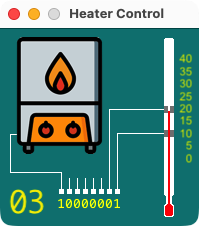

<style>
img[alt=center] {
	display: block;
	margin: 0 auto;
}
img[alt=sep] {
	display: block;
	margin: 0 auto;
	margin-top: 50px;
	margin-bottom: 40px;
}
pre[alt=term] {
	background: #1E2832;
	color: #7DCE10;
}
code {
	background: yellow;
}
</style>


# MicroSim x86

## 1. Introduction

MicroSim x86 est un simulateur de microprocesseur 8 bits conçu comme un outil pédagogique pour l'apprentissage de la programmation en langage machine x86 de type MASM. Il fournit un environnement complet : un éditeur de code avec coloration syntaxique, une visualisation des registres et de la mémoire RAM 256 octets (données et adresses sur 8 bits) ainsi que plusieurs périphériques virtuels interactifs.

L'objectif est d'illustrer les concepts fondamentaux de l'architecture des ordinateurs, tels que les registres, la mémoire, la pile, et le fonctionnement interne d'un CPU à travers un jeu d'instructions simple, mais complet et réaliste.

MicroSim est multiplateforme (car développé en Java) et comme il embarque sa propre machine virtuelle, il est autonome : pas besoin d'installer Java sur la machine hôte. Des scripts bash de packaging sont proposés pour chaque plateforme.

Ce projet d'inspire de deux autres projets open-source similaires :

- Le simulateur [x86 Microprocessor Simulator](https://github.com/dwhinham/Microprocessor-Simulator) de C. N. Bauers, hébergé par Dale Whinham.
- Le simulateur en ligne [Simple 8-bit Assembler Simulator](https://github.com/Schweigi/assembler-simulator) de Marco Schweighauser.

## 2. Interface graphique

L'interface du simulateur comprends plusieurs zones qui vous permettent d'écrire, d'exécuter et de déboguer du code x86. Le contenu de la mémoire et des registres sont actualisés en continu pendant l'exécution, à vitesse ajustable ou en mode pas-à-pas :



### L'éditeur de code :

C'est la zone où vous écrivez votre programme en assembleur. L'éditeur offre une coloration syntaxique pour une meilleure lisibilité, ainsi qu'une fonction de reformatage / *beautifier* afin de normaliser la mise en forme du code.

### Le panneau des registres :

Situé à gauche de l'éditeur, ce panneau affiche en temps réel l'état de tous les registres du CPU :

- **Registres généraux :** `AL`, `BL`, `CL`, `DL`
- **Registres spécialisés :** `IP` (Instruction Pointer) et `SP` (Stack Pointer)
- **Registre d'état (flags) :** `SR` affiche les drapeaux `...SZOCF` qui caractérisent la dernière opération.

### La barre d'outils :

Située au dessus de l'éditeur, elle donne accès aux fonctionnalités principales :


- **Start / stop :** Démarre / arrête l'exécution du programme (un curseur permet de régler la vitesse).
- **Step-by-step :** Active / désactive le mode pas-à-pas, pour une analyse détaillée.
- **Execute one :** Exécute une instruction lorsque le mode pas-à-pas est activé.
- **Compile :** Compile un petit programme en langage C vers un code assembleur MicroSim.
- **Assemble :** Traduit le code source en code machine exécutable et le charge en mémoire.
- **Show / hide RAM :** Ouvre la fenêtre de visualisation du contenu de la mémoire 256 octets.
- **Reset the system :** Réinitialise le processeur et la mémoire du simulateur.
- **Show / hide the display :** Ouvre / Ferme le terminal ASCII 4 lignes de 16 caractères.
- **Show / hide the keyboard :** Ouvre / Ferme le clavier (représente le clavier physique).
- **Show / hide the traffic lights :** Ouvre / Ferme les feux tricolores de circulation.
- **Show / hide the heater device :** Ouvre / Ferme le combiné chaudière-thermostat.
- **New program file :** Crée un nouveau fichier assembleur dans l'éditeur de code.
- **Open program file :** Ouvre un fichier existant dans l'éditeur de code.
- **Save program as :** Sauvegarde le programme de l'éditeur vers un fichier.
- **Undo edition :** Annule une modification dans l'éditeur.
- **Redo edition :** Refait une modification annulée.
- **Reformat code :** Normalise la mise en forme du code assembleur.
- **Execution speed :** Ajuste la vitesse d'exécution du programme.
- **User manual :** Ouvre cette documentation dans un navigateur.

### La mémoire RAM :

Il est possible de visualiser le contenu de la mémoire vive (RAM) sous la forme d'une table de 16x16 octets notés sous forme hexadécimale ou ASCII. C'est un outil essentiel pour déboguer et comprendre comment vos données et votre code sont stockés. La visualisation indique également les emplacements pointés par les regitres `IP` (en rouge) et `SP` (en bleu) :



## 3. Périphériques virtuels

MicroSim x86 inclus plusieurs périphériques d'entrée/sortie qui peuvent être contrôlés par programme via des adresses mémoire ou des ports d'E/S.

| Périphérique | Type | Adresse / Port | Opération |
|---|---|---|---|
| Terminal ASCII | Mémoire | `0xC0` à `0xFF` | `MOV [addr], AL` |
| Clavier | Port | `0x01` | `IN 0x01` |
| Feux tricolores | Port | `0x02` | `OUT 0x02` |
| Chauffage | Port | `0x03` | `IN 0x03` / `OUT 0x03` |

### Le terminal ASCII (mapé en mémoire) :

C'est un petit écran texte de 4 lignes de 16 colonnes. Pour afficher un caractère, il suffit d'écrire son code ASCII en RAM dans la zone-mémoire située entre les adresses `0xC0` et `0xFF` (soit 64 caractères) :


### Le clavier (via le port 01) :

Le clavier permet d'entrer des caractères via l'intruction `IN 0x01` qui déclenche une attente d'une action sur le clavier physique de l'ordinateur. Le code ASCII de la touche actionnée sera placé dans le registre `AL` :



### Les feux tricolores (via le port 02) :

Ce périphérique simule deux feux de circulation. L'instruction `OUT 0x02` envoie la valeur du registre `AL` au périphérique pour contrôler les lumières. Chaque bit de l'octet dans `AL` correspond à une couleur d'un des deux feux :


### Le système de chauffage (via le port 03) :

Ce périphérique représente un système de chauffage simple.

- L'instruction `OUT 0x03` contrôle la chaudière selon la valeur du bit 7 (MSB) du registre `AL`.
- L'instruction `IN 0x03` modifie le registre `AL` selon l'état du système (bits 0, 1 et 7).



## 4. Guide de démarrage rapide

1.  **Écrivez votre code :**
	- Tapez votre programme dans l'éditeur de code.
	- Ou déposez un fichier .c ou .asm dans l'éditeur.
2. **Compilez-le :**
	- Si c'est un programme C vous devez le compiler pour produire un code ASM.
	- Le compilateur C est extrêmement limité (voir la <a href=#compiler>syntaxe</a> supportée).
3.  **Assemblez-le :**
	- Cliquez sur le bouton "Assembler". Les erreurs de syntaxe seront affichées dans une fenêtre de dialogue.
3.  **Exécutez votre programme :**
	- Cliquez sur "Exécuter" pour lancer le programme et réglez la vitesse d'exécution.
	- Cliquez sur "Pas-à-pas" pour exécuter une instruction à la fois et observer les effets de chaque instruction sur les registres et la mémoire.
4.  **Déboguez :**
	- Utilisez le mode pas-à-pas et les fenêtres des périphériques pour trouver et corriger les erreurs dans votre logique.


<center>
# Référence de l'assembleur MicroSim x86
</center>

## 1. Concepts de base

### Les registres `AL`, `BL`, `CL`, `DL`, `SP`, `IP`, `SR` :

Les registres sont des zones de stockage ultra-rapides intégrées au cœur du CPU. Leur taille correspond à la taille des bus internes du microprocesseur (soit 8 bits), Pour manipuler une donnée, le processeur doit d'abord la charger depuis la mémoire dans un de ses registres. On distingue les registres à usage général et les registres spécialisés :

- **Registres généraux `AL`, `BL`, `CL`, `DL` :** Utilisés pour les calculs (`ADD`, `SUB`, etc.), les comparaisons (`CMP`) et les mouvements de données (`MOV`).
- **Pointeur de pile `SP` :** Un registre spécial qui contient l'adresse du sommet de la pile. Il est modifié par les instructions dédiées `PUSH` et `POP`.
- **Pointeur d'instruction `IP` :** Pointe toujours vers la prochaine instruction à exécuter. Vous ne le modifiez jamais directement, mais via les instructions de saut (`JMP`, `CALL`, etc.).
- **Le registre d'état `SR` :** Contient des drapeaux (flags) qui donnent des informations sur le résultat de la dernière opération effectuée. C'est un octet de la forme `...SZOCF` où chaque lettre correspond à un bit significatif :

| Bit | Nom | Description |
|:---:|:---:|---|
| `S` | Sign | Indique un résultat **négatif** pour les nombres **signés en complément à 2** (correspond à la valeur du MSB) |
| `Z` | Zero | Indique un résultat égal à zéro |
| `O` | Overflow | Indique un **dépassement de capacité** pour les nombres **signés en complément à 2** lorsque le résultat d'une opération sort de l'intervalle `[-128, 127]` |
| `C` | Carry | Indique un **dépassement de capacité** pour les nombres **non signés** suite à une addition (retenue) ou d'une soustraction (emprunt) |
| `F` | Fault | Indique une erreur irrécupérable causée par :<br>- Division par zéro<br>- Débordement de pile (Stack Overflow) lorsque `SP < 0x80`<br>- Sous-dépassement de pile (Stack Underflow) lorsque `SP > 0xBF`<br>- Pointeur d'instruction `IP` hors des limites de la mémoire<br>- Code d'opération (Opcode) invalide ou inconnu |

### La mémoire adressable :

La mémoire peut être vue comme une **grande armoire avec des tiroirs numérotés**. Chaque emplacement contient un octet (8 bits) et possède une adresse unique. Vous pouvez y stocker des données à plus long terme que dans les registres. On y accède via les syntaxes `[adresse]` et `[registre]` (notation crochet).

### La pile (stack) :

La pile est une **zone de mémoire spéciale organisée comme une pile d'assiettes** (c'est une structure de données LIFO : Last In / First Out). Elle est essentielle pour appeler des procédures (subroutines) et sauvegarder l'état du processeur.

Dans une architecture x86, la pile grandit vers les adresses basses et `SP` pointe toujours vers la **case mémoire vide** juste en dessous du dernier élément ajouté. Dans MicroSim, le pointeur `SP` est initialisé à l'adresse `0xBF`, juste avant la mémoire du terminal ASCII.

**Schéma de la pile après `PUSH AL` puis `PUSH BL` :**

```
           Mémoire
        +-----------+
0xBD    |    ...    | <--- SP (Pointeur de la pile)
        +-----------+
0xBE    | Valeur BL | <--- [SP+1]
        +-----------+
0xBF    | Valeur AL | <--- [SP+2] (Base de la pile)
        +-----------+
        |    ...    |
```

### Les étiquettes (labels) :

Une étiquette est un nom que vous pouvez donner à une ligne de votre code pour marquer une adresse mémoire. Elle est définie en écrivant un nom suivi de deux-points (`:`) :

```asm
etiquette:
    mov AL, 0x01
```

Les étiquettes sont essentielles car elles permettent de faire référence à des adresses de manière symbolique, sans avoir à calculer leur valeur manuellement. L'assembleur les remplace automatiquement par les adresses correspondantes lors de la compilation. Elles sont principalement utilisées avec les instructions de saut (`JMP`, `JZ`, etc.) et pour accéder à des données.

### Les opérandes et les modes d'adressage :

Une instruction est composée d'un **code d'opération** (opcode) et éventuellement de plusieurs **opérandes**. Certaines instructions (comme `HLT`) n'ont pas d'opérande, d'autres (comme `OUT`) en ont une seule, d'autre encore (comme `MOV`) en ont deux. Les notations des opérandes sont données dans le tableau suivant :

| Opérande | Description | Exemples |
|---|---|---|
| `reg` | Un des registres généraux 8 bits : `AL`, `BL`, `CL`, `DL` | `AL` |
| `[reg]` | Une adresse mémoire contenue dans un registre | `[BL]` |
| `[addr]` | Une adresse mémoire directe | `[0x50]`  |
| `[SP+offset]` | Adresse mémoire relative au pointeur de pile avec un offset (décalage) | `[SP+4]` |
| `byte` | Un octet noté en hexadécimal ou en décimal | `0xFF`, `255` |
| `addr` | Une adresse notée en hexadécimal ou en décimal (utilisé par les sauts) | `0x50`, `80` |
| `label` | Une étiquette (utilisé par les sauts) | `my_label` |
| `char` | Un caractère littéral | `'A'` |
| `string` | Une chaîne de caractères littérale | `"Hello"` |


### Modification des flags :

Ce tableau résume quelles instructions affectent quels drapeaux :

- **`-`** indique que le flag n'est pas affecté par l'instruction
- **`✓`** indique que le flag est modifié en fonction du résultat
- **`0`** indique que le flag est toujours mis à 0

| Instruction | SF | ZF | OF | CF |
|:---:|:---:|:---:|:---:|:---:|
| `MOV`, `PUSH`, `POP` | - | - | - | - |
| `ADD`, `SUB`, `CMP`, `NEG` | ✓ | ✓ | ✓ | ✓ |
| `INC` | ✓ | ✓ | ✓ | ✓ |
| `DEC` | ✓ | ✓ | ✓ | - |
| `AND`, `OR`, `XOR` | ✓ | ✓ | 0 | 0 |
| `NOT` | ✓ | ✓ | 0 | 0 |
| `SHL`, `SHR` | ✓ | ✓ | 0 | ✓ |
| `MUL` | ✓ | ✓ | ✓ | ✓ |
| `DIV` | ✓ | ✓ | 0 | 0 |
| `Jumps`, `CALL`, `RET` | - | - | - | - |
| `PUSHF`, `POPF` | ✓ | ✓ | ✓ | ✓ |


## 2. Directives d'assemblage

Une directive d'assemblage n'est pas une instruction du microprocesseur, c'est une commande envoyée à l'assembleur au moment de la production du code exécutable.

### `ORG` (origin)
- **Description :** Détermine l'adresse de la prochaine instruction (ou donnée) à charger.
- **Syntaxe :**
    - `ORG addr`

### `DB` (define byte)
- **Description :** Alloue et initialise un ou plusieurs octets de données.
- **Syntaxes :**
    - `DB byte`
    - `DB 'char'`
    - `DB "string"`


## 3. Jeu d'instructions du micro-processeur

Le processeur ne comprend pas directement les instructions textuelles comme `MOV AL, 0x10`. L'assembleur se charge de traduire chaque ligne de code en une séquence d'octets que le CPU peut exécuter : c'est le **code machine**. Par exemple, `MOV AL, 0x10` est traduit par la séquence `01 00 10` (trois octets notés en hexa).

Chaque instruction est convertie en un premier octet appelé **code opératoire** (ou *opcode*), qui identifie de manière unique l'opération et les types de ses opérandes. Cet opcode est ensuite suivi en mémoire par les octets représentant les arguments (les *opérandes*), comme un numéro de registre, une valeur numérique ou une adresse.

Toute opérande de type `reg` est codée sur un octet :

| Registre | Code Hexa |
|---|---|
| `AL` | `0x00` |
| `BL` | `0x01` |
| `CL` | `0x02` |
| `DL` | `0x03` |

### Contrôle du programme :

### `HLT` (halt)
- **Description :** Arrête l'exécution du programme.

| Syntaxe | Opcode | Adressage | Format en Mémoire |
|:---|:---:|:---|:---|
| `HLT` | `0x00` | Implicite | `00` |

### Instructions de mouvement de données :

### `MOV` (move)
- **Description :** Copie une valeur d'une source vers une destination.

| Syntaxe | Opcode | Adressage | Format en Mémoire |
|:---|:---:|:---|:---|
| `MOV reg, byte` | `0x01` | Immédiat | `01 reg byte` |
| `MOV reg, reg` | `0x02` | Registre | `02 reg reg` |
| `MOV reg, [addr]` | `0x03` | Direct | `03 reg addr` |
| `MOV reg, [reg]` | `0x04` | Indirect | `04 reg reg` |
| `MOV reg, [SP+offset]` | `0x05` | Offset | `05 reg offset`|
| `MOV [addr], byte` | `0x06` | Immédiat | `06 addr byte` |
| `MOV [addr], reg` | `0x07` | Registre | `07 addr reg` |
| `MOV [reg], byte` | `0x08` | Immédiat | `08 reg byte` |
| `MOV [reg], reg` | `0x09` | Registre | `09 reg reg` |
| `MOV [SP+offset], reg`| `0x0A` | Registre | `0A offset reg`|

### Instructions arithmétiques :

### `INC` (increment)
- **Description :** Incrémente la valeur d'un registre de 1.

| Syntaxe | Opcode | Adressage | Format en Mémoire |
|:---|:---:|:---|:---|
| `INC reg` | `0x13` | Registre | `13 reg` |

### `DEC` (decrement)
- **Description :** Décrémente la valeur d'un registre de 1.

| Syntaxe | Opcode | Adressage | Format en Mémoire |
|:---|:---:|:---|:---|
| `DEC reg` | `0x14` | Registre | `14 reg` |

### `NEG` (negation)
- **Description :** Effectue un complément à 2 sur la valeur d'un registre.

| Syntaxe | Opcode | Adressage | Format en Mémoire |
|:---|:---:|:---|:---|
| `NEG reg` | `0x15` | Registre | `15 reg` |

### `ADD` (addition)
- **Description :** Additionne la valeur de la source au registre de destination.

| Syntaxe | Opcode | Adressage | Format en Mémoire |
|:---|:---:|:---|:---|
| `ADD reg, byte` | `0x0B` | Immédiat | `0B reg byte` |
| `ADD reg, reg` | `0x0C` | Registre | `0C reg reg` |
| `ADD reg, [addr]` | `0x0D` | Direct | `0D reg addr` |
| `ADD reg, [reg]` | `0x0E` | Indirect | `0E reg reg` |

### `SUB` (subtraction)
- **Description :** Soustrait la valeur de la source du registre de destination.

| Syntaxe | Opcode | Adressage | Format en Mémoire |
|:---|:---:|:---|:---|
| `SUB reg, byte` | `0x0F` | Immédiat | `0F reg byte` |
| `SUB reg, reg` | `0x10` | Registre | `10 reg reg` |
| `SUB reg, [addr]` | `0x11` | Direct | `11 reg addr` |
| `SUB reg, [reg]` | `0x12` | Indirect | `12 reg reg` |

### `MUL` (multiplication)
- **Description : :** Multiplie la valeur de la source au registre de destination.

| Syntaxe | Opcode | Adressage | Format en Mémoire |
|:---|:---:|:---|:---|
| `MUL reg, byte` | `0x36` | Immédiat | `36 reg byte` |
| `MUL reg, reg` | `0x37` | Registre | `37 reg reg` |
| `MUL reg, [addr]` | `0x38` | Direct | `38 reg addr` |
| `MUL reg, [reg]` | `0x39` | Indirect | `39 reg reg` |

### `DIV` (division)
- **Description :** Divise la valeur de la source au registre de destination.

| Syntaxe | Opcode | Adressage | Format en Mémoire |
|:---|:---:|:---|:---|
| `DIV reg, byte` | `0x3A` | Immédiat | `3A reg byte` |
| `DIV reg, reg` | `0x3B` | Registre | `3B reg reg` |
| `DIV reg, [addr]` | `0x3C` | Direct | `3C reg addr` |
| `DIV reg, [reg]` | `0x3D` | Indirect | `3D reg reg` |

### Instructions logiques :

### `AND`
- **Description :** Effectue un ET logique (bitwise AND) entre le registre de destination et la source.

| Syntaxe | Opcode | Adressage | Format en Mémoire |
|:---|:---:|:---|:---|
| `AND reg, byte` | `0x3E` | Immédiat | `3E reg byte` |
| `AND reg, reg` | `0x3F` | Registre | `3F reg reg` |
| `AND reg, [addr]` | `0x40` | Direct | `40 reg addr` |
| `AND reg, [reg]` | `0x41` | Indirect | `41 reg reg` |

### `OR`
- **Description : :** Effectue un OU logique (bitwise OR) entre le registre de destination et la source.

| Syntaxe | Opcode | Adressage | Format en Mémoire |
|:---|:---:|:---|:---|
| `OR reg, byte` | `0x42` | Immédiat | `42 reg byte` |
| `OR reg, reg` | `0x43` | Registre | `43 reg reg` |
| `OR reg, [addr]` | `0x44` | Direct | `44 reg addr` |
| `OR reg, [reg]` | `0x45` | Indirect | `45 reg reg` |

### `XOR`
- **Description : :** Effectue un OU exclusif (bitwise XOR) entre le registre de destination et la source.

| Syntaxe | Opcode | Adressage | Format en Mémoire |
|:---|:---:|:---|:---|
| `XOR reg, byte` | `0x46` | Immédiat | `46 reg byte` |
| `XOR reg, reg` | `0x47` | Registre | `47 reg reg` |
| `XOR reg, [addr]` | `0x48` | Direct | `48 reg addr` |
| `XOR reg, [reg]` | `0x49` | Indirect | `49 reg reg` |

### `NOT`
- **Description : :** Inverse tous les bits d'un registre (bitwise NOT).

| Syntaxe | Opcode | Adressage | Format en Mémoire |
|:---|:---:|:---|:---|
| `NOT reg` | `0x4A` | Registre | `4A reg` |

### `SHL` (shift left)
- **Description :** Décale les bits du registre de destination vers la gauche.

| Syntaxe | Opcode | Adressage | Format en Mémoire |
|:---|:---:|:---|:---|
| `SHL reg, byte` | `0x4B` | Immédiat | `4B reg byte` |
| `SHL reg, reg` | `0x4C` | Registre | `4C reg reg` |
| `SHL reg, [addr]` | `0x4D` | Direct | `4D reg addr` |
| `SHL reg, [reg]` | `0x4E` | Indirect | `4E reg reg` |

### `SHR` (shift right)
- **Description :** Décale les bits du registre de destination vers la droite.

| Syntaxe | Opcode | Adressage | Format en Mémoire |
|:---|:---|:---:|:---|:---|
| `SHR reg, byte` | `0x4F` | Immédiat | `4F reg byte` |
| `SHR reg, reg` | `0x50` | Registre | `50 reg reg` |
| `SHR reg, [addr]` | `0x51` | Direct | `51 reg addr` |
| `SHR reg, [reg]` | `0x52` | Indirect | `52 reg reg` |

### Instructions de comparaison et de saut :

### `CMP` (compare)
- **Description :** Compare deux valeurs et met à jour les drapeaux (Zero, Carry) en fonction du résultat de la soustraction (destination - source).

| Syntaxe | Opcode | Adressage | Format en Mémoire |
|:---|:---|:---:|:---|:---|
| `CMP reg, byte` | `0x16` | Immédiat | `16 reg byte` |
| `CMP reg, reg` | `0x17` | Registre | `17 reg reg` |
| `CMP reg, [addr]` | `0x18` | Direct | `18 reg addr` |
| `CMP reg, [reg]` | `0x19` | Indirect | `19 reg reg` |

### `JUMP`
- **Description :** Saut inconditionnel vers une adresse ou un label.

| Syntaxe | Opcode | Adressage | Format en Mémoire |
|:---|:---:|:---|:---|
| `JMP addr` | `0x1A` | Direct | `1A addr` |
| `JMP [reg]` | `0x1B` | Indirect | `1B reg` |

### `JC` / `JB` (jump if carry / jump if below)
- **Description :** Saute si le drapeau de retenue (Carry Flag) est à 1.

| Syntaxe | Opcode | Adressage | Format en Mémoire |
|:---|:---:|:---|:---|
| `JC addr` | `0x1C` | Direct | `1C addr` |
| `JC [reg]` | `0x1D` | Indirect | `1D reg ` |

### `JNC` / `JAE` (jump if no carry / jump if above or equal)
- **Description :** Saute si le drapeau de retenue (Carry Flag) est à 0.

| Syntaxe | Opcode | Adressage | Format en Mémoire |
|:---|:---:|:---|:---|
| `JNC addr` | `0x1E` | Direct | `1E addr` |
| `JNC [reg]` | `0x1F` | Indirect | `1F reg` |

### `JZ` / `JE` (jump if zero / jump if equal)
- **Description :** Saute si le drapeau Zéro (Zero Flag) est à 1.

| Syntaxe | Opcode | Adressage | Format en Mémoire |
|:---|:---:|:---|:---|
| `JZ addr` | `0x20` | Direct | `20 addr` |
| `JZ [reg]` | `0x21` | Indirect | `21 reg` |

### `JNZ` / `JNE` (jump if not zero / jump if not equal
- **Description :** Saute si le drapeau Zéro (Zero Flag) est à 0.

| Syntaxe | Opcode | Adressage | Format en Mémoire |
|:---|:---:|:---|:---|
| `JNZ addr` | `0x22` | Direct | `22 addr` |
| `JNZ [reg]` | `0x23` | Indirect | `23 reg` |

### `JA` / `JNBE` (jump if above / jump if not below or equal)
- **Description :** Saute si les drapeaux Zéro et Retenue sont tous les deux à 0.

| Syntaxe Complète | Opcode | Adressage | Format en Mémoire |
|:---|:---:|:---|:---|
| `JA addr` | `0x24` | Direct | `24 addr` |
| `JA [reg]` | `0x25` | Indirect | `25 reg` |

### `JNA` / `JBE` (jump if not above / jump if below or equal)
- **Description :** Saute si le drapeau Zéro ou le drapeau Retenue est à 1.

| Syntaxe | Opcode | Adressage | Format en Mémoire |
|:---|:---|:---:|:---|:---|
| `JNA addr` | `0x26` | Direct | `26 addr` |
| `JNA [reg]` | `0x27` | Indirect | `27 reg` |

### `JS` (jump if sign)
- **Description :** Saute si le drapeau de signe (Sign Flag) est à 1 (résultat négatif).

| Syntaxe Complète | Opcode | Adressage | Format en Mémoire |
|:---|:---:|:---|:---|
| `JS addr` | `0x28` | Direct | `28 addr` |
| `JS [reg]` | `0x29` | Indirect | `29 reg` |

### `JNS` (jump if not sign)
- **Description :** Saute si le drapeau de signe (Sign Flag) est à 0 (résultat positif ou nul).

| Syntaxe Complète | Opcode | Adressage | Format en Mémoire |
|:---|:---:|:---|:---|
| `JNS addr` | `0x2A` | Direct | `2A addr` |
| `JNS [reg]` | `0x2B` | Indirect | `2B reg` |

### Gestion de la pile :

### `PUSH`
- **Description :** Empile une valeur sur la pile.

| Syntaxe Complète | Opcode | Adressage | Format en Mémoire |
|:---|:---:|:---|:---|
| `PUSH byte` | `0x2C` | Immédiat | `2C byte` |
| `PUSH reg` | `0x2D` | Registre | `2D reg` |
| `PUSH [addr]` | `0x2E` | Direct | `2E addr` |
| `PUSH [reg]` | `0x2F` | Indirect | `2F reg` |

### `POP`
- **Description :** Dépile une valeur de la pile vers un registre.

| Syntaxe Complète | Opcode | Adressage | Format en Mémoire |
|:---|:---:|:---|:---|
| `POP reg` | `0x30` | Registre | `30 reg` |

### `PUSHF` (push flags)
- **Description : :** Empile le contenu du registre SR (sauvegarde des flags).

| Syntaxe Complète | Opcode | Adressage | Format en Mémoire |
|:---|:---:|:---|:---|
| `PUSHF` | `0x31` | Implicite | `31` |

### `POPF` (pop flags)
- **Description : :** Dépile vers le registre SR (restauration des flags).

| Syntaxe Complète | Opcode | Adressage | Format en Mémoire |
|:---|:---:|:---|:---|
| `POPF` | `0x32` | Implicite | `32` |

### Instructions de sous-programmes (subroutines) :

### `CALL`
- **Description : :** Appelle un sous-programme en empilant l'adresse de retour et en sautant à l'adresse du sous-programme.

| Syntaxe | Opcode | Adressage | Format en Mémoire |
|:---|:---:|:---|:---|
| `CALL addr` | `0x33` | Direct | `33 addr` |
| `CALL [reg]` | `0x34` | Indirect | `34 reg` |

### `RET` (return)
- **Description : :** Revient d'un sous-programme en dépilant l'adresse de retour de la pile.

| Syntaxe Complète | Opcode | Adressage | Format en Mémoire |
|:---|:---:|:---|:---|
| `RET` | `0x35` | Implicite | `35` |

### Instructions d'entrées / sorties :

### `OUT`
- **Description :** Écrit la valeur du registre `AL` sur un port d'entrée/sortie.

| Syntax | Opcode | Adressage | Format en Mémoire |
|:---|:---:|:---|:---|
| `OUT byte` | `0x53` | Immédiat | `53 byte` |

### `IN`
- **Description :** Lit une valeur depuis un port d'entrée/sortie et la stocke dans le registre `AL`.

| Syntaxe | Opcode | Adressage | Format en Mémoire |
|:---|:---:|:---|:---|
| `IN byte` | `0x54` | Immédiat | `54 byte` |


## 4. Exemple de code assembleur

L'incontournable "Hello World" dans sa version MicroSim x86 :

```
; ----- Section programme ------------

	mov	CL, 0xC0  ; Adresse d'affichage
	mov	BL, 0x50  ; Adresse de la chaîne
Rep:
	mov	AL, [BL]  ; Adresse du caractère
	cmp	AL, 0x00  ; Fin de la chaîne ?
	jz	Fin
	mov	[CL], AL  ; Afficher le caractère
	inc	CL        ; Caractère suivant
	inc	BL        ; Emplacement suivant
	jmp	Rep
Fin:
	hlt

; ----- Section données ------------

	org	0x50
	
	db	"Hello World"
	db	0x00
```


<div id="compiler"></div>
## 5. Syntaxe C supportée par le mini-compilateur

Cette partie résume la syntaxe du langage C reconnue par le mini-compilateur intégré au simulateur MicroSim. Le compilateur est très basique et ne supporte qu'un sous-ensemble strict du C.

- **Point d'entrée** : Le programme doit obligatoirement contenir une fonction `void main()`
- **Modèle mémoire** : Les variables sont allouées statiquement. Il n'y a pas de pile dynamique pour les variables locales au-delà des paramètres de fonction.

### Déclaration et affectation des variables :

- **Déclaration simple** : `int ma_variable;`
- **Déclaration avec initialisation** : `int compteur = 10;`
- **Types de données** : Le seul type de données géré est `int`
- **Assigner une valeur numérique** : `compteur = 25;`
- **Assigner la valeur d'une autre variable** : `var2 = var1;`

### Opérateurs arithmétiques :

Le compilateur supporte les opérations arithmétiques entre deux variables ou entre une variable et une valeur numérique :

```c
resultat = variable1 + variable2;
resultat = variable1 - variable2;
resultat = variable1 * variable2;
resultat = variable1 / variable2;
resultat = variable1 + 10;
resultat = variable1 - 10;
resultat = variable1 * 2;
resultat = variable1 / 2;
```

Les opérateurs d'auto-assignation sont également supportés avec une valeur numérique. Les opérations entre deux variables ne peuvent pas être combinées avec les opérateurs d'auto-assignation. Les opérateurs `++` (incrémentation) et `--` (décrémentation) sont également supportés :

```c
variable += 10;
variable -= 10;
variable *= 2;
variable /= 2;
variable++;
variable--;
```

### Opérateurs de pointeur :

Les opérateurs d'adresse `&` et de déréférencement `*` sont supportés pour les assignations simples :

- **Prendre l'adresse d'une variable** :

  ```c
  int valeur = 123;
  int ptr;
  ptr = &valeur; // ptr contient maintenant l'adresse de 'valeur'
  ```

- **Obtenir la valeur pointée (déréférencement)** :

  ```c
  int resultat;
  // Suite de l'exemple précédent
  resultat = *ptr; // resultat vaut maintenant 123
  ```

### Opérateurs de comparaison :

Les opérateurs `>`, `<`, `==`, `!=`, `>=` et `<=` sont supportés dans les conditions `if` et `while` :

```c
if (compteur <= 10) {
  // ...
}

while (compteur != 0) {
  // ...
}
```

### Opérateurs logiques :

L'opérateur logique `&&` est supporté pour combiner plusieurs conditions mais l'opérateur `||` n'est pas supporté :

```c
if (a > 5 && b < 10) {
  // ...
}
```

### Structures de contrôle :

Les structures `if` et `if else` sont supportées mais le `else if` n'est pas reconnu :

```c
if (variable > 5) {
  // Code à exécuter si la condition est vraie
}

if (variable > 5) {
  // Code à exécuter si la condition est vraie
} else {
  // Code à exécuter si la condition est fausse
}
```

La boucle `while` est supportée. La condition peut utiliser tous les opérateurs de comparaison supportés :

```c
while (compteur != 0) {
  compteur = compteur - 1;
}
```

### Fonctions :

Chaque programme doit avoir une fonction `main` qui sert de point d'entrée :

```c
void main() {
  // Le programme commence ici
}
```

Les autres fonctions doivent obligatoirement retourner un `int` et prendre un seul paramètre de type `int` :

```c
int ma_fonction(int parametre) {
  // ...
  return parametre;
}
```


